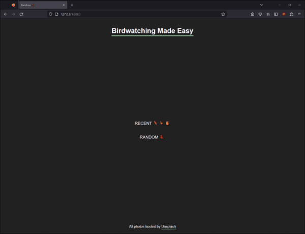

# :bird: Random Bird :parrot::flamingo::owl:

  

Enjoy the beauty of birds without the need to travel using the combined power of [**Ktor**](https://ktor.io/) and the 
[**Unsplash Image API**](https://unsplash.com/developers).

## :memo: Web App details

A minimalist web page with the sole purpose of being a link between the client (a.k.a. the ornithophile :heart:) and a 
collection of high-quality bird images. Currently only two options are available:
- Getting a random ball of feathers with every page reload
- Getting the 3 top-liked results from the first page of the latest bird images on Unsplash

## :briefcase: Features

- Frontend entirely reliant on Ktor serving [FreeMarker](https://freemarker.apache.org/) templated content
- Requests to the Unsplash API handled by Ktor's `HttpClient`
- JSON deserialization into nested data classes using the `ContentNegotiation` plugin
- Unit testing of the HTTP client using `MockEngine`
- Image creator attribution with :heart: and a direct link to their Unsplash profile

## :computer: Run web app

Swap out the `accessKey` placeholder in [`UnsplashClient`](src/main/kotlin/dev/bogwalk/models/UnsplashClient.kt) 
for your own access key from the [Unsplash API](https://unsplash.com/documentation#creating-a-developer-account).

Clone the repository then pick an option:

- `./gradlew run` from an open terminal in the root of the project

- Open the project in IntelliJ IDEA and run `Application.kt`

- Open the Gradle toolbar and select `random-bird/Tasks/application/run`

Open the logged url `http://localhost:8080/` in a browser.

## :microscope: Run tests

Clone the repository then pick an option:

- Open the project in IntelliJ IDEA then choose specific tests using gutter icons or right-click the `src/test` folder and 
select `Run 'Tests in 'random-bird.test''`

- Open the Gradle toolbar and select `random-bird/Tasks/verification/test`